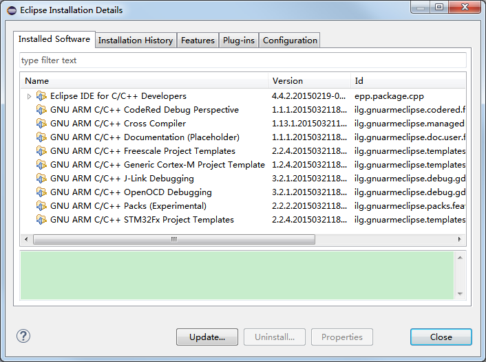

# Create ARM Cross Compile Environment Using Eclipse CDT #

---
Last updated: 2015/04/09    
Edited by: Guohui Xu

## Resources Preparation ##

1. Download the latest JAVA installer. [[Download](http://java.com/zh_CN/)]

2. Download latest Eclipse IDE for C/C++ developers. [[Download](http://www.eclipse.org/downloads/packages/eclipse-ide-cc-developers/lunasr2)]

3. Download GNU ARM Eclipse plug-ins. [[Download](http://sourceforge.net/projects/gnuarmeclipse/)]

4. Download GNU ARM GCC Toolchain. [[Download](https://launchpad.net/gcc-arm-embedded)]

5. Download GNU ARM Build tools. [[Download](http://sourceforge.net/projects/gnuarmeclipse/files/Build%20Tools/gnuarmeclipse-build-tools-win32-2.4-201503242026-setup.exe/download)]

## Theory ##

#### What is Eclipse CDT? ####

Eclipse is an general platform for different program language development. You can use it to edit your source code and maintain your project. It allows you to install various plug-ins to suit your requirements. For C/C++ develpers, Eclipse provides a plug-in named [CDT](http://eclipse.org/cdt/), shorting for C/C++ Development Tooling. With the CDT, you can configure the C/C++ toolchain, maintain, build, download and debug your project.

If you have downloaded the Eclipse IDE for C/C++ developers, then the CDT is defaultly installed with Eclipse and you can develop C/C++ projects on Eclipse IDE. But notice that the IDE DO NOT  suopport developing C/C++ project for ARM at this time. You can only create C/C++ project and build the target to run on Windows, MAC OSX and Linux. The instructions to make it support creating project for ARM will be listed in the following sections.

#### Why do we need to install JAVA on our PC? ####

Since the Eclipse IDE is created using JAVA language, so the Eclipse must running in the JAVA supported environment. It just like a fish borns in water, so it has to survive in water. It has to mention that if you are going to install the 32-bits Eclipse IDE, you need to install the latest 32-bits JAVA version. If you are going to install the 64-bits Eclipse IDE, you need to install the latest 64-bits JAVA version. Or error will occure when starting the Eclipse IDE.

#### What's the relationship between GNU Make and GNU GCC Toolchain? ####
The GNU Make is a tool to parse the makefile. Every time you run the make command, it just looks for a makefile in the current working directory and parse it.

The GNU GCC Toolchain, including Assembler, Compiler, Linker, Debuger etc., is to make you generate and debug your target (e.g. executable program, HEX or binary file) from the source code. 

Without GNU Make, you have to compile your source code and link to target file manually. When your project is hude enough, then it is hard to compile your source files one by one. Besides, every time you building the target you have to compile all of your source files, since you don't known which file is modified since last compilation.

A makefile is a build rules collection file. In the other words, the makefile contains all the commands when you build your target manually. When you run the make command, it will parse the makefile and execute the commands in it. So with GNU Make you can just run the make command to build your target.   
  

Besides the make command, sometimes we need other commands such as to remove the target files or echo some informations to the console. These tools is collected together and is so called Build tools.
 

## Setup GNU ARM Build Tools and ARM GCC Toolchain	##

1. Install the GNU ARM Build tools. Double click on the "gnuarmeclipse-build-tools-win32-2.4-201503242026-setup.exe" to begin the installation procedure. You can install it under any path you want, except the path that containing the unusual characters. E.g., I install it under "F:\Eclipse\Build_Tools". These folders are listed like this:   
   
Under the "bin" folder, you will see the Build tools for ARM processors:      
 

2. Unzip the downloaded ARM gcc toolchain zip package. Copy the folders in it to under any path you want, except the path that containing the unusual characters. E.g., I copy the folders under "F:\Eclipse\Toolchain". These folders are listed like this:      
    
Under the "bin" folder, you will see the ARM gcc toolchain for ARM precessors:    
  

3. **[OPTIONAL]** You can add the GNU ARM Build tools path and the GNU ARM GCC Toolchain path to the system PATH, so that other programs can invoke them without specifying their path.   

## Setup Eclipse IDE ##

1. Install the latest JAVA version on your PC. If you are going to install the 32-bits Eclipse IDE, you need to install the latest 32-bits JAVA version. If you are going to install the 64-bits Eclipse IDE, you need to install the latest 64-bits JAVA version. Or error will occure when starting the Eclipse IDE.

2. Unzip the downloaded Eclipse zip package. Extract the folder named "eclipse". Copy it to under any path you want, except the path that containing the unusual characters. E.g., I copy the folders under "F:\Eclipse". 

3. Open the "eclipse" folder and double click on the "eclipse.exe" to start the Eclipse IDE. If any error occures, make sure you have installed the correct JAVA version on your PC. Before the IDE showing up, a prompt window pops up to let you select the workspace path. A workspace is a folder to store your projects. If you CHECK the box "Use this as the default and do not ask again", every time you start the IDE it will set this workspace as the default workspace. You can switch the workspace after the IDE showing up by clicking "File > Switch Workspace > Other..."    

4. After the IDE showing up, it looks like the belowing picture.    

5. Click on the "Help > Installation Details" on the menu bar. You will see that below the "Installed Software" tab, there is only the Eclipse CDT installed. And under the "Plug-ins" tab, there lists the plug-ins those has been installed in Eclipse.    
      

6. Click on the "Help > Install New Software..." on the menu bar.    
  
Click on the "Add..." button. It offers two methods to install a new sofware, either search the gived path to look for Eclipse plug-ins to install or select specified archive file.    
  
Click on the "Archive..." button and navigate to the downloaded GNU ARM Eclipse Plug-ins(a .zip or .jar file) and select it. Then you will see that the plug-in name showed in the "Name" field as below.    
   
Keep clicking "Next" until it asks you whether accept the agreement. Just choose accept and click on "Finish" to begin installing progress.    
    
During the installing progress, it will pop up a window to ask you whether continue the pregress, since the validity of the plug-in cannot be established. Just click on "OK" to continue.    
   
After the plug-in is installed, it asks you ao restart the Eclipse to make the new installed plug-in take effect. Just click on "Yes" to restart the Eclipse.   
   

7. After the Eclipse restarted, click on the "Help > Installation Details" on the menu bar. You will see that below the "Installed Software" tab, the GNU ARM Plug-ins have been installed. But it doesn't mean that you can develop applications for ARM now, since the plug-ins do not contain the ARM gcc toolchain and Build tools. It only support that you can create a project based on the ARM gcc toolchain. We need to tell the Eclipse where they locate so that Eclipse can invoke them to build the project.   
   

8. Click on the "Windows > Preferences" on the menu bar. Expand the "C/C++ > Build" option and click on the "Global Tools Paths" tag. Browse to select the Build tools folder. Select the default toolchain to be "GNU Tools for ARM Embedded processors" and browse to select the Toolchain folder.   
   

9. Now you can develop your applications for ARM processors on Eclipse IDE now!

## New C Project ##

## New Makefile Project with Existing code ##

Specify the makefile path:
 

## FAQ ##

1. If we create a new Makefile project with existing code and the existing code contain its own toolchain, when building the project, it would prompt that "incorrect 'make' used". This is because of eclipse invoking the default 'make' tool that from where the variable "PATH" specified. Eclipse will search the "make" tool in the paths that the "PATH" variable specified one by one from the first path to the end path.   
   

	- If we put the path of the "make" tool which provided by the existing code to the first location of the "PATH" variable, when building the project, eclipse will firstly search the "make" tool in the path we just add to so that it will invoke the self-providing "make" tool. For example, if the self-providing "make" tool locates at "F:\Eclipse\WICED-SDK-3.3.1\WICED_SDK331", we just click the "Edit..." button to add this path in front of the "PATH" content:        
	   

	- We can disable the default build command, instead of using a specified build command. Uncheck the box of "Use default build command" and select the "Variables..."       
	  
	Choose the variable "workspace_loc" and then full fill the relative path of the make tool:     
	  